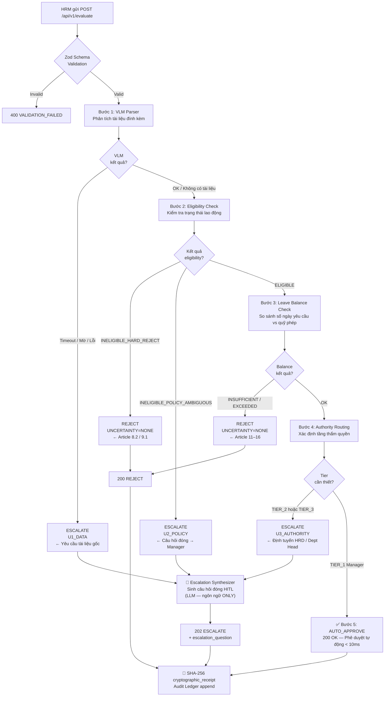

# ClearFlowHR — Autonomous HR Escalation Referee (AER)

> **Hệ thống Trọng tài Phân xử Nghỉ phép Tự động** — middleware AI xử lý và phân xử tự động các yêu cầu nghỉ phép, nghỉ ốm và nghỉ thai sản từ hệ thống HRM, với độ trễ dưới 10ms cho các ca hợp lệ và giao thức Human-in-the-Loop (HITL) đơn lượt cho các ca ngoại lệ.

```
┌─────────────┐   POST /api/v1/evaluate   ┌──────────────────────────────────┐
│  HRM System │ ────────────────────────► │   AER Middleware (ClearFlowHR)   │
└─────────────┘                           │                                  │
                                          │  VLM → Eligibility → Balance →   │
                                          │  Authority → AUTO_APPROVE /       │
                                          │  REJECT / ESCALATE (HITL)         │
                                          └──────────────────────────────────┘
```

---

## Mục lục

1. [Tổng quan dự án](#1-tổng-quan-dự-án)
2. [Triết lý kiến trúc](#2-triết-lý-kiến-trúc)
3. [Không gian bất định 3 chiều](#3-không-gian-bất-định-3-chiều)
4. [Tech Stack](#4-tech-stack)
5. [Cấu trúc thư mục](#5-cấu-trúc-thư-mục)
6. [Luồng xử lý chi tiết](#6-luồng-xử-lý-chi-tiết)
7. [Data Contracts — Zod Schemas](#7-data-contracts--zod-schemas)
8. [Phân tích từng module](#8-phân-tích-từng-module)
9. [API Reference](#9-api-reference)
10. [Benchmark Suite — 15 Test Cases](#10-benchmark-suite--15-test-cases)
11. [Safety Boundaries](#11-safety-boundaries)
12. [Hướng dẫn chạy dự án](#12-hướng-dẫn-chạy-dự-án)
13. [Lộ trình phát triển](#13-lộ-trình-phát-triển)

---

## 1. Tổng quan dự án

**ClearFlowHR / AER** là một hệ thống middleware tự động hóa toàn bộ luồng phê duyệt nghỉ phép tại doanh nghiệp, giải quyết nút thắt cổ chai lớn nhất trong quản trị nhân sự: *thời gian chờ phê duyệt*.

### Vấn đề cần giải quyết

| Tình trạng hiện tại | Sau khi triển khai AER |
|---|---|
| Quản lý tra cứu thủ công → vài phút đến vài giờ | Auto-approve < **10ms** |
| Email/chat nội bộ không có audit trail | Mọi quyết định có **SHA-256 cryptographic receipt** |
| Phê duyệt sai do nhầm lẫn quy chế | **Rào chắn tiền định (deterministic guardrails)** — không LLM |
| HITL kém hiệu quả (click "Đồng ý" mù quáng) | Câu hỏi đóng đơn lượt, ra quyết định trong < **15 giây** |
| Nguy cơ lộ PII trong log | PII được **SHA-256 hóa** trước khi ghi |

### Tác động định lượng

- **Giảm 85%** khối lượng công việc sự vụ cho quản lý cơ sở
- **Loại bỏ 100%** nguy cơ phê duyệt sai chứng từ y tế C65-HD (mẫu BHXH)
- Bảo vệ lực lượng lao động tri thức khỏi *automation bias* (thiên kiến tự động hóa) thông qua giao thức HITL được thiết kế lại

---

## 2. Triết lý kiến trúc

AER được xây dựng trên nguyên tắc **phân tách rạch ròi** giữa hai lớp:

```
┌──────────────────────────────────────────────────────────┐
│           LỚP XÁC SUẤT (Probabilistic Layer)             │
│   Qwen2.5-VL VLM  ·  LLM Escalation Synthesizer          │
│   → Chỉ được dùng cho: OCR hình ảnh, sinh ngôn ngữ       │
│   → TUYỆT ĐỐI KHÔNG tính toán ngày phép, xác minh luật  │
├──────────────────────────────────────────────────────────┤
│           LỚP TIỀN ĐỊNH (Deterministic Layer)            │
│   Rules Engine  ·  Zod Schemas  ·  Audit Ledger          │
│   → Tất cả logic nghiệp vụ: số học nguyên, lookup table  │
│   → Kết quả 100% reproducible — không phụ thuộc LLM     │
└──────────────────────────────────────────────────────────┘
```

> **Nguyên tắc cốt lõi:** Một LLM là hệ thống xác suất — cùng một đầu vào có thể cho kết quả khác nhau qua mỗi lần chạy. Trong ngành nhân sự, điều này là rủi ro không thể chấp nhận được. AER dùng LLM **chỉ để sinh ngôn ngữ**, không bao giờ để ra quyết định.

---

## 3. Không gian bất định 3 chiều

Mọi yêu cầu nghỉ phép tồn tại trong một không gian bất định 3 chiều trực giao. Điểm gốc tọa độ `(0,0,0)` là ca hoàn hảo → `AUTO_APPROVE` < 10ms.

| Chiều | Ký hiệu | Bản chất sự cố | Ví dụ thực tiễn | Hành động của AER |
|---|---|---|---|---|
| **Bất định Dữ kiện** | `U1_DATA` | Dữ liệu đầu vào thiếu, suy hao chất lượng, không xác thực được | Ảnh C65-HD bị mờ phần ngày tháng; thiếu mộc đỏ BHXH; thiếu chữ ký bác sĩ | Dừng tự động. Yêu cầu nhân viên bổ sung tài liệu gốc trong 3 ngày |
| **Xung đột Chính sách** | `U2_POLICY` | Dữ liệu rõ ràng nhưng vi phạm quy chế nội bộ hoặc pháp luật | Nhân viên thử việc xin nghỉ phép năm (vi phạm Quy chế 18/2024/QC-NS – Điều 8.2) | `ESCALATE` → Câu hỏi đóng gửi quản lý trực tiếp: "Chuyển sang nghỉ không lương hay từ chối?" |
| **Vượt Thẩm quyền** | `U3_AUTHORITY` | Hồ sơ hợp lệ nhưng vượt hạn mức phân cấp của quản lý | Nghỉ không lương > 20 ngày; nghỉ thai sản; nghỉ ốm > 5 ngày liên tục | `ESCALATE` → Định tuyến thẳng lên Giám đốc Nhân sự (HRD) |

---

## 4. Tech Stack

| Thành phần | Công nghệ | Vai trò |
|---|---|---|
| Runtime | **Node.js 20 LTS** | Server-side JavaScript |
| Language | **TypeScript 7** (strict mode) | Type safety toàn bộ codebase |
| Framework | **Express 5** | RESTful API server |
| Schema Validation | **Zod 4** | Runtime validation + inferred types |
| VLM (Vision-Language) | **Qwen2.5-VL** (local) | OCR mẫu C65-HD, phát hiện mộc đỏ & chữ ký |
| Cryptography | **Node.js `crypto`** (built-in) | SHA-256 receipt, PII hashing |
| Testing | **Vitest 5** | 15-case benchmark suite |
| Linting | **ESLint 10** + `@typescript-eslint` | Code quality enforcement |
| Package Manager | **pnpm 12** | Workspace management |

---

## 5. Cấu trúc thư mục

```
ClearFlowHR/
│
├── AGENTS.md                          # 📋 Quy tắc ràng buộc cho AI coding agents
├── README.md                          # 📖 Tài liệu này
├── package.json                       # pnpm@12.5.1, scripts
├── tsconfig.json                      # TypeScript strict + NodeNext
├── vitest.config.ts                   # Vitest test runner config
│
├── src/
│   ├── index.ts                       # 🚀 Express app entry point
│   │
│   ├── api/
│   │   └── routes/
│   │       ├── schemas.ts             # ⭐ Core Zod data contracts (nguồn sự thật)
│   │       ├── evaluate.ts            # POST /api/v1/evaluate handler
│   │       └── override.ts            # POST /api/v1/override handler
│   │
│   ├── core/
│   │   ├── orchestrator.ts            # 🎯 Pipeline điều phối chính (5 bước)
│   │   ├── workflow.ts                # 🔄 HITL state machine (Interrupt & Resume)
│   │   └── rules/                     # 🔒 Deterministic Rules Engine
│   │       ├── index.ts               # Barrel export
│   │       ├── leave_balance.ts       # Kiểm tra quỹ phép (số học nguyên thuần túy)
│   │       ├── eligibility.ts         # Ma trận trạng thái × loại nghỉ phép
│   │       └── authority.ts           # Định tuyến thẩm quyền (3 tầng)
│   │
│   ├── ai/
│   │   ├── vlm_parser.ts              # 👁️ Qwen2.5-VL OCR (stub → Phase 3)
│   │   └── escalation_synthesizer.ts  # 🤖 Sinh câu hỏi HITL (RANH GIỚI LLM DUY NHẤT)
│   │
│   └── ledger/
│       └── audit.ts                   # 🔐 SHA-256 receipt + PII hashing
│
└── tests/
    └── benchmark/
        ├── helpers.ts                 # Factory fixture makeRequest()
        ├── 01_auto_approve.test.ts    # Cases 01–04: AUTO_APPROVE
        ├── 02_reject.test.ts          # Cases 05–07: REJECT
        ├── 03_escalate_u2_policy.test.ts  # Cases 08–10: ESCALATE U2_POLICY
        ├── 04_escalate_u3_authority.test.ts # Cases 11–13: ESCALATE U3_AUTHORITY
        └── 05_edge_cases.test.ts      # Cases 14–15: Invariants & cryptography
```

---

## 6. Luồng xử lý chi tiết



---

## 7. Data Contracts — Zod Schemas

Tất cả API payload bắt buộc phải qua Zod validation. File nguồn: [`src/api/routes/schemas.ts`](src/api/routes/schemas.ts).

### 7.1 `EmployeeLeaveRequest` — Input Schema

```typescript
{
  request_id:         string (UUID v4)
  employee_id:        string (SHA-256 hex — KHÔNG lưu plain text PII)
  employee_name:      string (1–120 ký tự)
  employment_status:  "PROBATION" | "CONFIRMED" | "CONTRACT" | "RESIGNED"
  leave_type:         "ANNUAL" | "SICK" | "MATERNITY" | "PATERNITY" | "UNPAID" | "COMPASSIONATE"
  start_date:         string (YYYY-MM-DD)
  end_date:           string (YYYY-MM-DD)
  days_requested:     integer > 0
  leave_balance: {
    annual_days_remaining:      integer ≥ 0
    sick_days_remaining:        integer ≥ 0
    maternity_weeks_remaining:  integer ≥ 0
    unpaid_days_used_ytd:       integer ≥ 0
  }
  attached_documents: AttachedDocument[]   // tài liệu C65-HD cho VLM
  submitted_at:       string (ISO 8601)
}
```

### 7.2 `EvaluationResponse` — Output Schema

```typescript
{
  decision_id:            string (UUID v4)
  outcome:                "AUTO_APPROVE" | "ESCALATE" | "REJECT"
  uncertainty_category:   "U1_DATA" | "U2_POLICY" | "U3_AUTHORITY" | "NONE"
  policy_basis:           string (trích dẫn điều khoản — không do LLM sinh)
  escalation_question?:   string (có khi outcome=ESCALATE — do LLM sinh ngôn ngữ)
  cryptographic_receipt:  string (SHA-256 hex 64 ký tự — BẮT BUỘC)
  evaluated_at:           string (ISO 8601)
}
```

**Ràng buộc Zod `.refine()` bắt buộc:**

| Điều kiện | Quy tắc |
|---|---|
| `outcome = ESCALATE` | `uncertainty_category` phải là `U1_DATA`, `U2_POLICY`, hoặc `U3_AUTHORITY` |
| `outcome = ESCALATE` | `escalation_question` phải có giá trị (không được undefined) |
| `outcome ≠ ESCALATE` | `uncertainty_category` phải là `"NONE"` |
| Mọi response | `cryptographic_receipt` phải khớp `/^[a-f0-9]{64}$/` |

### 7.3 `HitlOverrideRequest` — HITL Input

```typescript
{
  decision_id:    string (UUID — phải là ESCALATE decision)
  request_id:     string (UUID)
  reviewer_id:    string (SHA-256 hex — KHÔNG lưu plain text)
  resolution:     "APPROVE" | "REJECT" | "SWITCH_LEAVE_TYPE"
  new_leave_type?: LeaveType  // bắt buộc khi resolution = SWITCH_LEAVE_TYPE
  reviewer_notes?: string (max 1000 ký tự)
  override_at:    string (ISO 8601)
}
```

---

## 8. Phân tích từng module

### 8.1 `src/core/orchestrator.ts` — Điều phối pipeline

Trung tâm điều phối của toàn hệ thống. Chạy 5 bước theo thứ tự tuần tự, dừng lại ngay khi gặp điều kiện REJECT hoặc ESCALATE. **Không có LLM trong logic rẽ nhánh.**

```typescript
export async function runEvaluation(request: EmployeeLeaveRequest): Promise<EvaluationResponse>
```

Đảm bảo SLA < 10ms cho `AUTO_APPROVE` và `REJECT` (không gọi LLM). Đường dẫn `ESCALATE` phát sinh thêm độ trễ synthesis.

---

### 8.2 `src/core/rules/leave_balance.ts` — Kiểm tra quỹ phép

**Chức năng:** So sánh `days_requested` với số dư trong `leave_balance` theo từng loại nghỉ phép.

**Quan trọng:** Toàn bộ là số học nguyên thuần túy TypeScript. Không có LLM. Thực thi trong O(1).

| Loại nghỉ | Giới hạn | Điều khoản |
|---|---|---|
| `ANNUAL` | `annual_days_remaining` (quỹ còn lại) | Điều 11.1 |
| `SICK` | `sick_days_remaining` (quỹ còn lại) | Điều 12.1 |
| `MATERNITY` | `maternity_weeks_remaining × 7` ngày, tối đa 26 tuần | Điều 34 BLLĐ |
| `PATERNITY` | Tối đa 14 ngày/sự kiện | Điều 34.2 |
| `UNPAID` | Không có trần (track YTD audit) | Điều 16.1 |
| `COMPASSIONATE` | Tối đa 5 ngày/sự kiện | Điều 15.1 |

---

### 8.3 `src/core/rules/eligibility.ts` — Ma trận tư cách hưởng phép

**Chức năng:** Kiểm tra `employment_status × leave_type` qua một ma trận lookup bất biến.

**Kết quả có thể trả về:**
- `ELIGIBLE` → Tiếp tục pipeline
- `INELIGIBLE_HARD_REJECT` → Dừng, trả về `REJECT` (không cần xét thêm)
- `INELIGIBLE_POLICY_AMBIGUOUS` → Dừng, trả về `ESCALATE` với `U2_POLICY`

**Các trường hợp quan trọng (Article 8.2 / 9.1 / 10.3):**

| Employment Status | Leave Type | Kết quả | Điều khoản |
|---|---|---|---|
| `PROBATION` | `ANNUAL` | `HARD_REJECT` | Điều 8.2 — Thử việc không được nghỉ phép năm hưởng lương |
| `PROBATION` | `MATERNITY` | `POLICY_AMBIGUOUS` | Điều 8.2 + 34 — Xung đột quyền thai sản vs quy chế thử việc |
| `PROBATION` | `PATERNITY` | `POLICY_AMBIGUOUS` | Điều 8.2 + 34.2 |
| `RESIGNED` | Mọi loại | `HARD_REJECT` | Điều 9.1 — Nhân viên đã nghỉ việc không được khởi tạo yêu cầu mới |
| `CONTRACT` | `MATERNITY` | `POLICY_AMBIGUOUS` | Điều 10.3 — Phụ thuộc thời gian đóng BHXH |
| `CONFIRMED` | Mọi loại | `ELIGIBLE` | — |

---

### 8.4 `src/core/rules/authority.ts` — Định tuyến thẩm quyền

**Chức năng:** Xác định tầng thẩm quyền cần thiết theo Điều 20 (Chính sách phê duyệt phân cấp).

```
Số ngày ≤ 5   AND   không phải loại đặc biệt  →  TIER_1_MANAGER   → AUTO_APPROVE
Số ngày 6–14  OR   PATERNITY                   →  TIER_2_DEPT_HEAD  → ESCALATE U3
Số ngày ≥ 15  OR   MATERNITY                   →  TIER_3_HR_DIRECTOR → ESCALATE U3
```

Hàm `isTierAutoApprovable(tier)` trả về `true` **chỉ khi** `tier === "TIER_1_MANAGER"`.

---

### 8.5 `src/ai/vlm_parser.ts` — OCR tài liệu C65-HD

**Mô hình:** Qwen2.5-VL chạy local (không gửi dữ liệu ra ngoài).

**Output (discriminated union):**

```typescript
type VlmParseOutcome =
  | { success: true;  result: VlmAnalysisResult }
  | { success: false; failure_reason: "TIMEOUT" | "IMAGE_QUALITY_TOO_LOW" | "MODEL_UNAVAILABLE" | "UNSUPPORTED_FORMAT"; document_id: string }
```

**Quy tắc an toàn (fail-safe):**
- Confidence score < 0.70 → `IMAGE_QUALITY_TOO_LOW` → `ESCALATE U1_DATA`
- Timeout > 5000ms → `TIMEOUT` → `ESCALATE U1_DATA`
- **Tuyệt đối không** dùng LLM để nội suy (impute) ngày tháng bị thiếu

> **Nguyên tắc "Zero Imputation on Ambiguity":** Nếu VLM không chắc chắn về một trường dữ liệu, hệ thống trả về `null` cho trường đó và kích hoạt `U1_DATA`, không bao giờ đoán mò.

---

### 8.6 `src/ai/escalation_synthesizer.ts` — Ranh giới LLM duy nhất

**Đây là module DUY NHẤT trong toàn hệ thống được phép dùng LLM.**

LLM nhận vào `policy_basis` và `uncertainty_category` đã được xác định bởi rules engine, và **chỉ có nhiệm vụ duy nhất**: sinh ra câu hỏi đóng đơn lượt bằng ngôn ngữ tự nhiên rõ ràng, chuyên nghiệp.

**Template mẫu cho từng chiều bất định:**

| Chiều | Mẫu câu hỏi |
|---|---|
| `U1_DATA` | `"Nhân viên [Tên] đã nộp đơn nghỉ [Loại] ([N] ngày) nhưng tài liệu đính kèm không thể xác minh. Lý do: [policy_basis]. Decision: [Yêu cầu bổ sung tài liệu] hoặc [Từ chối]?"` |
| `U2_POLICY` | `"Nhân viên [Tên] đang xin nghỉ [Loại] ([N] ngày), nhưng tư cách hưởng phép còn mơ hồ. Xung đột chính sách: [policy_basis]. Decision: [Duyệt như [Loại]] hoặc [Chuyển sang UNPAID] hoặc [Từ chối]?"` |
| `U3_AUTHORITY` | `"Nhân viên [Tên] đang xin nghỉ [Loại] ([N] ngày), cần phê duyệt từ [Tầng thẩm quyền]. Cơ sở: [policy_basis]. Decision: [Duyệt] hoặc [Từ chối]?"` |

> **Quy tắc AGENTS.md §5:** Câu hỏi PHẢI là câu đóng với lựa chọn cụ thể. KHÔNG được hỏi câu mở như "Bạn nghĩ thế nào về trường hợp này?"

---

### 8.7 `src/ledger/audit.ts` — Sổ cái kiểm toán mật mã

**Chức năng:**

```typescript
// Hash PII trước khi lưu trữ
function hashPii(plaintext: string): string
// → SHA-256 hex 64 ký tự

// Tạo cryptographic receipt cho quyết định
function generateEvaluationReceipt(payload: { decision_id, outcome, uncertainty_category, policy_basis, evaluated_at }): string
// → SHA-256 của canonical JSON (keys sắp xếp alphabet để đảm bảo determinism)

// Tạo receipt cho HITL override
function generateOverrideReceipt(payload: { decision_id, final_status, recorded_at }): string
```

**Chuỗi hash bao gồm:** mã hồ sơ + dấu thời gian + tác nhân ra quyết định + điều khoản được viện dẫn + trạng thái liền trước.

**Tính năng "Hoàn tác Lạc quan" (Phase 2):** Nếu C&B phát hiện bất thường trong hồ sơ đã auto-approve, có thể kích hoạt rollback trong vòng 0.1 giây, thu hồi trạng thái phê duyệt và hoàn lại quỹ phép một cách nhất quán.

---

### 8.8 `src/core/workflow.ts` — HITL State Machine

Quản lý vòng đời của một yêu cầu nghỉ phép qua các trạng thái:

```
PENDING_EVALUATION
    ├── → AUTO_APPROVED          (AUTO_APPROVE)
    ├── → REJECTED               (REJECT)
    └── → ESCALATED_AWAITING_HITL  (ESCALATE)
              ├── → OVERRIDE_APPROVED
              ├── → OVERRIDE_REJECTED
              └── → LEAVE_TYPE_SWITCHED
```

> ⚠️ **"Ask First" module:** File này KHÔNG được thay đổi mà không có sự đồng ý trước. Xem AGENTS.md §2.

---

## 9. API Reference

### `POST /api/v1/evaluate`

Đánh giá một yêu cầu nghỉ phép và trả về quyết định.

**Request Body:** `EmployeeLeaveRequest` (xem §7.1)

**Response:**

| HTTP Code | Ý nghĩa | Body |
|---|---|---|
| `200` | AUTO_APPROVE hoặc REJECT | `EvaluationResponse` |
| `202` | ESCALATE — HITL đang chờ | `EvaluationResponse` với `escalation_question` |
| `400` | Payload không hợp lệ | `{ error: "VALIDATION_FAILED", details: ZodError }` |

---

### `POST /api/v1/override`

Nhận kết quả phán quyết từ người duyệt (HITL reviewer) cho một quyết định đã ESCALATE.

**Request Body:** `HitlOverrideRequest` (xem §7.3)

**Response:** `HitlOverrideResponse`

```typescript
{
  decision_id:           string (UUID)
  final_status:          "APPROVED" | "REJECTED" | "LEAVE_TYPE_SWITCHED"
  cryptographic_receipt: string (SHA-256 hex)
  recorded_at:           string (ISO 8601)
}
```

---

### `GET /health`

Health check endpoint.

```json
{ "status": "ok", "service": "AER — Autonomous HR Escalation Referee" }
```

---

## 10. Benchmark Suite — 15 Test Cases

Hệ thống Verify Harness cho phép chạy toàn bộ 15 ca chỉ bằng một lệnh, xuất kết quả đối chiếu kèm timestamp và SHA-256 cho mỗi quyết định.

| # | File | Mô tả | Expected Outcome | Uncertainty |
|---|---|---|---|---|
| 01 | `01_auto_approve` | CONFIRMED + ANNUAL + 3 ngày + đủ số dư | `AUTO_APPROVE` | `NONE` |
| 02 | `01_auto_approve` | CONFIRMED + SICK + 3 ngày + đủ số dư | `AUTO_APPROVE` | `NONE` |
| 03 | `01_auto_approve` | CONFIRMED + UNPAID + 2 ngày (không có trần) | `AUTO_APPROVE` | `NONE` |
| 04 | `01_auto_approve` | CONFIRMED + COMPASSIONATE + 3 ngày (≤5) | `AUTO_APPROVE` | `NONE` |
| 05 | `02_reject` | **PROBATION + ANNUAL** → vi phạm Điều 8.2 | `REJECT` | `NONE` |
| 06 | `02_reject` | **RESIGNED + SICK** → vi phạm Điều 9.1 | `REJECT` | `NONE` |
| 07 | `02_reject` | CONFIRMED + ANNUAL + số dư không đủ (shortfall) | `REJECT` | `NONE` |
| 08 | `03_escalate_u2` | **PROBATION + MATERNITY** → xung đột Điều 8.2/34 | `ESCALATE` | `U2_POLICY` |
| 09 | `03_escalate_u2` | **PROBATION + PATERNITY** → xung đột Điều 8.2/34.2 | `ESCALATE` | `U2_POLICY` |
| 10 | `03_escalate_u2` | **CONTRACT + MATERNITY** → phụ thuộc BHXH Điều 10.3 | `ESCALATE` | `U2_POLICY` |
| 11 | `04_escalate_u3` | CONFIRMED + ANNUAL + **8 ngày** (TIER_2 range) | `ESCALATE` | `U3_AUTHORITY` |
| 12 | `04_escalate_u3` | CONFIRMED + SICK + **20 ngày** (TIER_3 range) | `ESCALATE` | `U3_AUTHORITY` |
| 13 | `04_escalate_u3` | CONFIRMED + **MATERNITY** + đủ số dư (luôn TIER_3) | `ESCALATE` | `U3_AUTHORITY` |
| 14 | `05_edge_cases` | Kiểm tra **tính determinism**: 2 lần gọi cùng input | Receipt hợp lệ cả 2 | Structural |
| 15 | `05_edge_cases` | SHA-256 receipt hợp lệ cho mọi outcome (cross-check) | 64-char hex tất cả | Cryptographic |

**Kết quả chạy thực tế (lần cuối):**

```
Test Files  5 passed (5)
     Tests  15 passed (15)
  Duration  659ms
```

---

## 11. Safety Boundaries

Tuân thủ nghiêm ngặt theo `AGENTS.md §2`:

### 🔴 NEVER — Tuyệt đối không được làm

- ❌ Dùng LLM để tính toán số ngày phép, xác minh luật lao động, hoặc xác định hạn mức thẩm quyền
- ❌ Log thông tin PII (tên, CMND, ID nhân viên) dưới dạng plain text — phải SHA-256 hóa trước
- ❌ Sửa đổi hoặc xóa dữ liệu mẫu trong `tests/benchmark/`
- ❌ Để VLM timeout hoặc lỗi → fail open (tự động approve) — phải ESCALATE với U1_DATA
- ❌ Dùng LLM để nội suy (impute) ngày tháng bị thiếu từ ảnh mờ

### 🟡 ASK FIRST — Hỏi trước khi thực hiện

- ⚠️ Cài đặt dependency mới (đặc biệt là thư viện AI / xử lý ảnh)
- ⚠️ Thay đổi state machine trong `src/core/workflow.ts`
- ⚠️ Thay đổi schema `EmployeeLeaveRequest`

### 🟢 ALWAYS — Luôn phải làm

- ✅ Viết/cập nhật unit test trong `tests/` khi thay đổi logic deterministic
- ✅ Tất cả API payload phải qua Zod schema validation
- ✅ Chạy `pnpm tsc --noEmit` và `pnpm run test:benchmark` sau mọi thay đổi logic

---

## 12. Hướng dẫn chạy dự án

### Yêu cầu hệ thống

- Node.js ≥ 20 LTS
- pnpm ≥ 12 (`curl -fsSL https://get.pnpm.io/install.sh | sh -`)

### Các lệnh cơ bản

```bash
# Cài đặt dependencies
pnpm install

# Kiểm tra type safety (BẮT BUỘC sau mọi thay đổi)
pnpm tsc --noEmit

# Chạy linter
pnpm run lint --fix

# Chạy toàn bộ 15-case benchmark
pnpm run test:benchmark

# Chạy một test file cụ thể
pnpm vitest run tests/benchmark/01_auto_approve.test.ts

# Khởi động dev server (hot-reload)
pnpm run dev
```

### Ví dụ gọi API

```bash
# AUTO_APPROVE case
curl -X POST http://localhost:3000/api/v1/evaluate \
  -H "Content-Type: application/json" \
  -d '{
    "request_id": "550e8400-e29b-41d4-a716-446655440000",
    "employee_id": "a665a45920422f9d417e4867efdc4fb8a04a1f3fff1fa07e998e86f7f7a27ae3",
    "employee_name": "Nguyen Van A",
    "employment_status": "CONFIRMED",
    "leave_type": "ANNUAL",
    "start_date": "2026-10-01",
    "end_date": "2026-10-03",
    "days_requested": 3,
    "leave_balance": {
      "annual_days_remaining": 10,
      "sick_days_remaining": 30,
      "maternity_weeks_remaining": 26,
      "unpaid_days_used_ytd": 0
    },
    "attached_documents": [],
    "submitted_at": "2026-09-22T00:00:00.000Z"
  }'
```

**Response mẫu (AUTO_APPROVE):**
```json
{
  "decision_id": "f47ac10b-58cc-4372-a567-0e02b2c3d479",
  "outcome": "AUTO_APPROVE",
  "uncertainty_category": "NONE",
  "policy_basis": "All checks passed — 3 day(s) of ANNUAL leave auto-approved under TIER_1_MANAGER authority. Article 11.1 — Annual leave balance sufficient. Article 20.1 — within direct manager authority.",
  "cryptographic_receipt": "3b4c5d6e7f8a9b0c1d2e3f4a5b6c7d8e9f0a1b2c3d4e5f6a7b8c9d0e1f2a3b4c",
  "evaluated_at": "2026-09-22T02:00:00.000Z"
}
```

---

## 13. Lộ trình phát triển

| Phase | Trạng thái | Nội dung |
|---|---|---|
| **Phase 1** | ✅ Hoàn thành | Scaffolding, Zod schemas, API stubs, TypeScript strict |
| **Phase 2** | ✅ Hoàn thành | Rules Engine (balance + eligibility + authority), Orchestrator, 15 Benchmark Tests |
| **Phase 3** | 🔲 Tiếp theo | Qwen2.5-VL client thực tế (OCR C65-HD), LLM synthesis API call |
| **Phase 4** | 🔲 Planned | Audit ledger persistence (append-only DB), HITL override full implementation |
| **Phase 5** | 🔲 Planned | Optimistic rollback, dashboard metrics, multi-tenant support |


